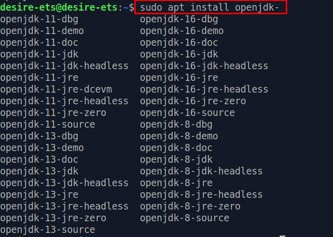

# jdk

# Instalación de JDK en el SO

## Índice

1. [Instalación desde repositorios](#instalacion)

2. [Instalar una versión específica de Java](#instalar)

3. [Configurar las variables de entorno](#configurar)

## 1. Instalación desde repositorios <a name="instalacion"></a>


Actualizamos desde el terminal con:
- ```sudo apt-get update```


Luego de actualizarlo, instalamos Java con:
- `sudo apt-get install default-jdk`


Comprobamos la versión que tenemos actualmente en nuestro SO con:

- `java -version`


Y como se ve en la captura se nos instalo la última versión disponible de OpenJDK

## 2. Instalar una versión específica de Java <a name="instalar"></a>

Para instalar las versiones de Java OpenJDK utilizaremos los siguientes comandos:
- `sudo apt install openjdk-11-jdk`


- `sudo apt install openjdk-9-jdk`


En la captura siguiente se muestra las opciones instalables de openJDK en linux, en nuestro caso no aparece la versión 9. En caso de que fuera esta la versión que fuéramos a usar, la podríamos descargar del repositorio web de Oracle.



- `sudo apt install openjdk-8-jdk`


La versión que usaremos este año será la 8. Ahora volveremos a comprobar que versión tenemos instalada.
- `java -version`


Si no nos aparece como última versión la 8, deberemos configurar las variables de entorno.

## 3. Configurar las variables de entorno.<a name="configurar"></a>

Deberemos configurar estas variables para que Linux sepa donde se encuentra ubicado el OpenJDK para ejecutarlo, y que versión usar de forma predeterminada.
Primero listamos klas versiones que tenfamos instaladas de OpenJDK, con el siguiente comando:

- `sudo ls /usr/lib/jvm`


Ahora podemos actualizar las variables de entorno modificando el fichero profile:
- `sudo nano /etc/profile`

Añadimos el siguiente texto:


Volvemos a ejecutar 'java -version' para comprobar que tiene por defecto la versión 8 de openJDK


